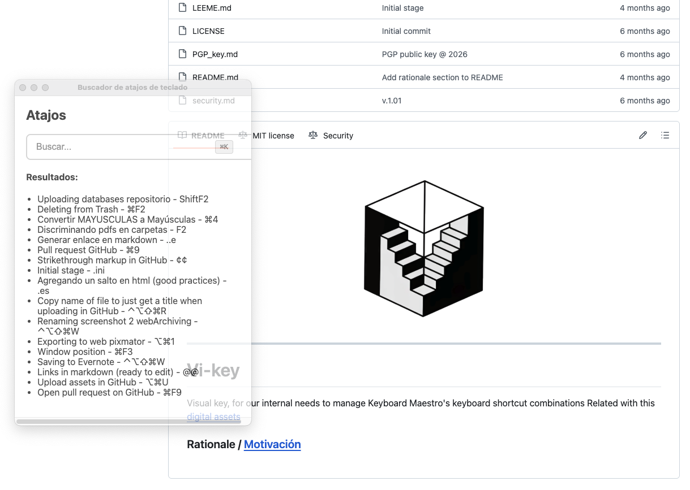

  

---

# Vi-key

## Motivación / [Rationale](README.md)

Visual key, for our internal needs to manage Keyboard Maestro's keyboard shortcut combinations.
Related with these [digital assets](https://github.com/imhicihu/Automation/tree/master/Keyboard_Maestro).

Desde su albor, la aplicación debía cumplir con ciertas premisas: ser transparente, minimalista, consumir pocos recursos en la memoria, ser monocromática, omnipresente y no intrusiva con ningún programa que esté ejecutándose.
Como tal, fue programada para cumplir con dichos objetivos. El código se encuentra [aquí](/code) y está sin compilar. Instale [Electron Fiddle](https://www.electronjs.org/fiddle) y ejecútelo. A continuación, copie y pegue el código que ha descargado previamente en `Fiddle`, respetando el contenido de cada uno de los 4 archivos suministrados. Este es el resultado:

